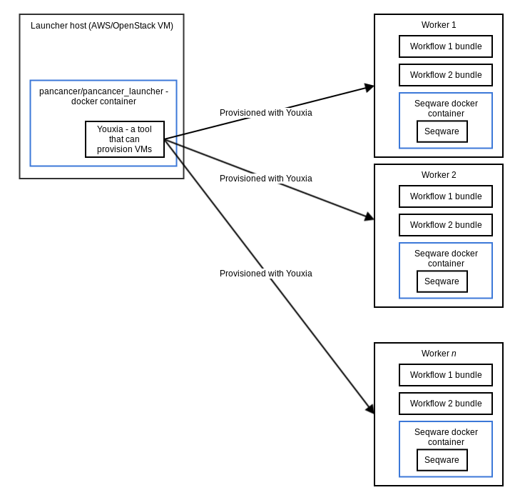

# Architectural Overview
========================

The Pancancer tools are designed to be run among a fleet of virtual machines in a cloud environment such as Amazon EC2 or OpenStack.

The diagram below illustrates how they fit together:

In this diagram, and launcher host is used to control other worker nodes. The launcher node is a VM instance that is started up manually. It will have the ability to start up worker nodes.

On the launcher host, there is a docker container, "pancancer/pancancer_launcher". This container contains many of the Pancancer project tools that are used to start up the worker nodes. The main tool used for starting up nodes is Bindle. It uses vagrant and ansible to create and configure the nodes.

On the worker nodes themselves, there are a few workflow bundles, and some seqware docker containers. The workflow bundles are archives that contain all of the code of a workflow (such as BWA or Sanger). The Seqware containers are docker containers that contain Seqware. There is actually more than one version of the Seqware container; the Bindle tool will install the correct containers based on which workflows are configured to run.
