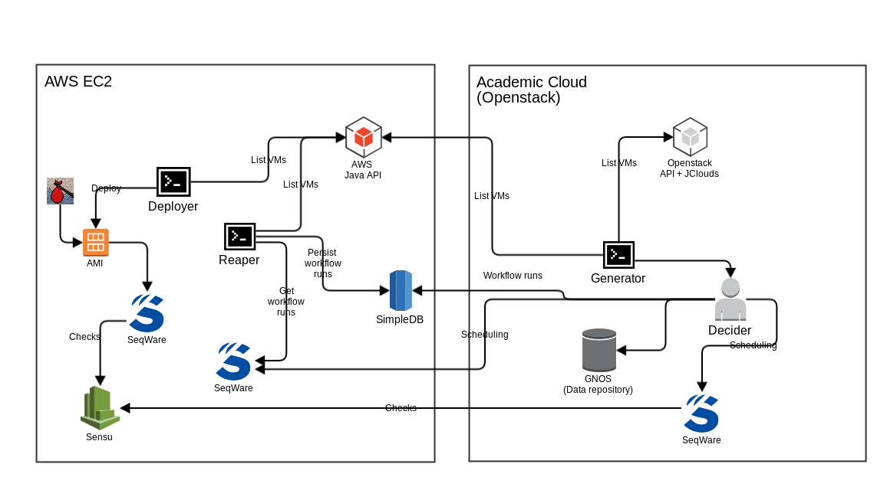

# PanCancer Architecture

## PanCancer Phases

### Phase I

Cloud Shepherds at OICR establish logins at each cloud environment and try the BWA alignment workflow on cell lines to ensure the answer is identical across clouds

### Phase II

Cloud Shepherds at OICR work with the community to create the core alignment workflow (BWA) and three core variant calling workflows (Sanger, Broad, and DKFZ/EMBL).  These are then run via automated deciders as data is uploaded to the GNOS repositories with BWA alignment happening first then the three variant calling workflows in parallel.

### Phase III

Researchers get accounts on these cloud systems and are able to login, launch VMs, and perform their own analysis by pulling files back from GNOS.

## Description

The architecture consists of two main parts: the GNOS servers that host all of the data and the clusters that process the data. 

### GNOS

There are several GNOS servers around the world which host the PanCancer data. They can be accessed with client tools such as "cgquery".

### Cloud Environments

The archtecture can be created on a number of cloud (and non-cloud) environments such as VirtualBox, vCloud, OpenStack and AWS. 

Bindle is our tool for creating these instances in conjunction with a few Ansible playbooks specific to Pancancer.
These tools can be used to create clusters of
virtual machines running in one of several cloud environments used by the
PanCancer project.  These clusters are used to process approximately 5,000
whole human genomes using standardized workflows: BWA and variant calling. This
constitutes "Phase II" of the project. "Phase III" will see the use of this
technology stack by a variety of researchers across the cloud environments
employed by the project to answer their specific research questions.

The environments built with Bindle provide both GridEngine and Hadoop
execution environments along with the full collection of SeqWare tools.

This process can be used to create both single compute instances for
small-scale computation and clusters of compute instances suitable for
larger-scale computation.

#### Development

VirtualBox is supported to allow workflow developers the abililty to spin up a SeqWare on their own computer. 

#### Provisioning

[Architecture Provisioning Scripts](https://github.com/ICGC-TCGA-PanCancer/architecture-setup) have been created to download, install and configure the environments with the various parts of the PanCancer Architecture. This system has been broken down into several GitHub projects for the sake of modularity. 

Depending on what you are intending on accomplishing you might want to setup the individual parts individually - each sub project can be installed independently. 

## Component Overview

While you will be learning about the various components in more detail as you proceed through the install guide for each role and component, this is a quick overview of most of the components for one pair of clouds. 

A commercial cloud can be paired with an academic cloud, SeqWare single-node instances run in each cloud, while youxia tooling (deployer, reaper) creates and tears down nodes running in AWS. We take advantage of the AWS and Openstack API in order to retrieve information on running instances while Sensu is used to aggregate data from checks collecting information about system status such disk space, running workflows, network IO performance, etc. A single decider queries GNOS and schedules workflows on the various SeqWare clusters. Finally, Bindle is used (in conjunction with the seqware-bag and pancancer-bag which are ansible playbooks) in order to create the original instances which can be imaged. 

Bindle can also be used in academic clouds to create instances (which may be imaged depending on what capabilities are available on each cloud). 

